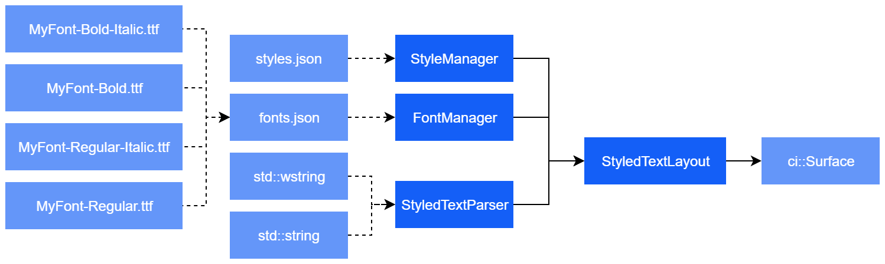

# Cinder-BluecadetText

This block contains a set of classes to deal with text and typography in Cinder on Windows.

Built around the need to have multi-line, auto-wrapping text with inline styles, the block grew into a framework to load and define font sets, styles and parse very simple styled text.

The core text rendering code is based on Cinder's own [`TextLayout`](https://libcinder.org/docs/classcinder_1_1_text_layout.html), but expands on layout, styling and caching functionality.

Built for and tested with [Cinder v0.9.1](https://github.com/cinder/Cinder/tree/v0.9.1) on Windows 7, 8.1 and 10. See [notes below](#notes) for setup instructions.

*Windows only! StyledTextLayout uses Windows-only GDI+ and currently has no Linux/Mac support.*

This block is compatible with and used by [Cinder-BluecadetViews](https://github.com/bluecadet/Cinder-BluecadetViews), which implements automatic rendering of text to textures in a scene-graph.



## Key Features

### StyledTextView

* Multi-line text layout with basic inline styling support
* HTML tags: `<b>`, `<i>`, `<br>`, `<p>`
* Configurable styles: `fontFamily`, `fontStyle`, `fontWeight`, `fontSize`, `leadingOffset`, `textColor`, `textAlign`, `textTransform`
* Automatic word-wrapping and other layout modes (single line, strip line-breaks, multi-line clip, multi-line auto-wrap)
* Full `string` and `wstring` support for all features
* Layout-caching minimizes re-calculation of layout while maintaining ability to call methods like `getSize()` at any time
* Ability to define a style from the `StyleManager`, which will be automatically applied to all text
* Multiple convenience overloads to define invidual styles and properties

### FontManager

* Load TTF font family defined on simple json
* Define multiple weights and styles per family
* Configurable auto-selection of closest font-weight (e.g. weight `500` is needed, but only `300` and `600` are available)

### StyleManager

* Loads basic styles from json
* Styles are hierarchical and can inherit properties from their parent styles

### StyledTextParser

* Parses `string` and `wstring`
* Outputs `StyledText` pairs of `string` (or `wstring`) combined with `Style`s

## Getting Started

### Basic StyledTextLayout Usage

```c++
// TODO
```

### Parsing Styled Text

```c++
// TODO
```

### Managing and Using Fonts

```c++
// TODO
```

### Managing and Using Styles

```c++
// TODO
```

## Notes

Version 1.1.0

Based on [Cinder v0.9.1](https://github.com/cinder/Cinder/tree/v0.9.1)

Cinder setup instructions:

```bash
git clone -b v0.9.1 --depth 1 --recursive https://github.com/cinder/Cinder.git
```

Cloning with all dependencies:

```bash
cd Cinder/blocks
git clone git@github.com:bluecadet/Cinder-BluecadetText.git
git clone git@github.com:bluecadet/Cinder-BluecadetView.git
```
